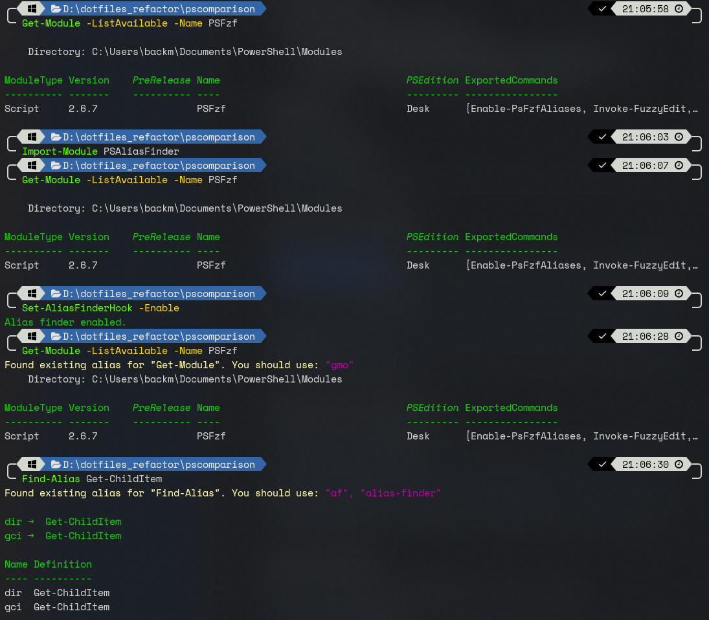

# PSAliasFinder

[](https://www.powershellgallery.com/packages/PSAliasFinder)
[](https://opensource.org/licenses/MIT)

> Intelligent alias discovery for PowerShell, inspired by the oh-my-zsh [alias-finder](https://github.com/ohmyzsh/ohmyzsh/tree/master/plugins/alias-finder) plugin.

PSAliasFinder helps you discover and use shorter aliases for PowerShell commands, improving your terminal productivity. It automatically suggests aliases when you type long commands and provides tools to search for available aliases.



## Features

- 🔍 **Intelligent Alias Search** - Find aliases for any PowerShell command
- 🎯 **Smart Filtering** - Only suggests aliases that save significant typing
- ⚡ **Automatic Suggestions** - Get alias recommendations as you type
- 🎨 **PSReadLine Integration** - Seamless integration with PowerShell prompt
- 🔧 **Flexible Configuration** - Enable/disable automatic suggestions easily
- 📊 **Multiple Search Modes** - Exact, longer, cheaper search options

## Installation

### From PowerShell Gallery (Recommended)

```powershell
Install-Module -Name PSAliasFinder -Scope CurrentUser
```

### Manual Installation

1. Download the latest release from GitHub
2. Extract to your PowerShell modules directory:
   - Windows: `$env:USERPROFILE\Documents\PowerShell\Modules\PSAliasFinder`
   - Linux/macOS: `~/.local/share/powershell/Modules/PSAliasFinder`

## Quick Start

### Import the Module

```powershell
Import-Module PSAliasFinder
```

### Search for Aliases Manually

```powershell
# Find aliases for a command
Find-Alias Get-ChildItem
# Output: gci -> Get-ChildItem
#         ls -> Get-ChildItem
#         dir -> Get-ChildItem

# Using the short alias
af Get-Process
# Output: gps -> Get-Process
#         ps -> Get-Process
```

### Enable Automatic Suggestions

```powershell
# Enable automatic alias detection
Set-AliasFinderHook -Enable

# Now when you type long commands, you'll get suggestions:
# PS> Get-ChildItem
#
# Found existing alias for "Get-ChildItem". You should use: "gci", "ls", "dir"
```

### Add to Your Profile

Add this to your PowerShell profile (`$PROFILE`) to enable automatically:

```powershell
Import-Module PSAliasFinder
Set-AliasFinderHook -Enable
```

Or configure with options:

```powershell
Import-Module PSAliasFinder
$global:PSAliasFinderConfig = @{ AutoLoad = $true }
```

## Usage Examples

### Basic Search

```powershell
# Find aliases for Get-ChildItem
Find-Alias Get-ChildItem

# Using the 'af' shorthand
af Get-Process

# Search with exact match only
af Get-ChildItem -Exact

# Include longer aliases (contains the command)
af Process -Longer
```

### Advanced Options

```powershell
# Only show aliases shorter than the command
af Get-ChildItem -Cheaper

# Bypass intelligent filtering (show all matches)
af ls -Force

# Suppress output, only return results
$aliases = af Get-Process -Quiet
```

### Hook Management

```powershell
# Enable automatic suggestions
Set-AliasFinderHook -Enable

# Disable automatic suggestions
Set-AliasFinderHook -Disable

# Configure with AutoLoad
Set-AliasFinderConfig -AutoLoad
```

## How It Works

PSAliasFinder uses intelligent filtering to avoid noise:

- ✅ **Command length check** - Only suggests for commands ≥8 characters
- ✅ **Complexity check** - Skips commands with multiple pipes or many arguments
- ✅ **Savings check** - Only suggests aliases that save ≥4 characters
- ✅ **AST parsing** - Accurately counts pipes using PowerShell's Abstract Syntax Tree

This ensures you only see helpful suggestions, not clutter.

## Commands Reference

### Find-Alias

Search for aliases matching a command.

**Syntax:**
```powershell
Find-Alias [-Command] <String[]> [-Exact] [-Longer] [-Cheaper] [-Quiet] [-Force]
```

**Parameters:**
- `-Command` - The command to search (required)
- `-Exact` - Find only exact matches
- `-Longer` - Include aliases longer than the command
- `-Cheaper` - Only show aliases shorter than the command
- `-Quiet` - Suppress console output
- `-Force` - Bypass intelligent filtering

**Aliases:** `af`, `alias-finder`

### Set-AliasFinderHook

Enable or disable automatic alias suggestions.

**Syntax:**
```powershell
Set-AliasFinderHook [-Enable] [-Disable]
```

**Parameters:**
- `-Enable` - Activate automatic suggestions
- `-Disable` - Deactivate automatic suggestions

### Set-AliasFinderConfig

Configure module behavior.

**Syntax:**
```powershell
Set-AliasFinderConfig [-AutoLoad]
```

**Parameters:**
- `-AutoLoad` - Enable automatic suggestions on module import

## Requirements

- PowerShell 5.1 or higher
- PSReadLine module (for automatic suggestions feature)

## Comparison with oh-my-zsh alias-finder

| Feature | oh-my-zsh | PSAliasFinder |
|---------|-----------|---------------|
| Find aliases | ✅ | ✅ |
| Exact/Longer/Cheaper modes | ✅ | ✅ |
| Automatic suggestions | ✅ | ✅ |
| Intelligent filtering | ❌ | ✅ |
| AST-based pipe counting | ❌ | ✅ |
| Complexity validation | ❌ | ✅ |
| Quiet mode | ❌ | ✅ |
| Force mode (show all) | ❌ | ✅ |

PSAliasFinder extends the original concept with PowerShell-specific enhancements and smarter filtering.

## Contributing

Contributions are welcome! Please feel free to submit a Pull Request.

1. Fork the repository
2. Create your feature branch (`git checkout -b feature/AmazingFeature`)
3. Commit your changes (`git commit -m 'Add some AmazingFeature'`)
4. Push to the branch (`git push origin feature/AmazingFeature`)
5. Open a Pull Request

## License

This project is licensed under the MIT License - see the [LICENSE](LICENSE) file for details.

## Acknowledgments

- Inspired by the [oh-my-zsh alias-finder plugin](https://github.com/ohmyzsh/ohmyzsh/tree/master/plugins/alias-finder)
- Built for the PowerShell community

## Support

- 🐛 Report issues on [GitHub Issues](https://github.com/backmind/PSAliasFinder/issues)
- 💬 Discuss on [GitHub Discussions](https://github.com/backmind/PSAliasFinder/discussions)
- ⭐ Star the project if you find it helpful!

---

**Made with ❤️ for PowerShell users**
